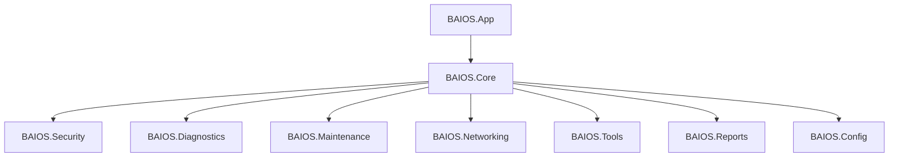

# Arquitectura de BAIOS 4

Decisiones **cerradas** en F2 (2026-08-17). Producto: [visión](vision.md). Permisos: [seguridad](seguridad.md).

## Stack (F2-01)

| Pieza | Decisión |
| --- | --- |
| Runtime | **.NET 8** (Windows). Subir a .NET 9/10 solo si es LTS y F3 ya compiló. |
| UI | **WPF**. |
| Distribución 4.0 | **Self-contained**, unpackaged (`win-x64`). Un zip/carpeta portable. |
| Lenguaje | C# |
| Licencia del motor | GNU GPL v3. Terceros: la suya. |

**Por qué WPF y no WinUI 3:** USB/técnico sin Windows App SDK ni MSIX en 4.0. WinUI 3 queda como alternativa si en 4.2 se quiere Fluent + MSIX; no se reabre en F3 salvo bloqueo técnico de WPF.

El prototipo `test2` (WinForms 4.7.2) **no** se evoluciona a esta estructura.

## Estructura de solución (F2-02)

Un ejecutable WPF; el resto son class libraries. Namespaces: `BAIOS.*`.

```
src/
├── BAIOS.App/              # WPF, BAIOS.exe
├── BAIOS.Core/             # contratos, hallazgos, sesión, config
├── BAIOS.Security/         # Defender, firewall (lectura/acciones)
├── BAIOS.Diagnostics/      # hardware, SMART, servicios, procesos, inicio, drivers
├── BAIOS.Maintenance/      # temp, caché, papelera, DISM, SFC, CHKDSK (advertido)
├── BAIOS.Networking/       # IP, DNS, ping, tracert, flush, DHCP
├── BAIOS.Tools/            # lanzar procesos según ficha (4.0); manifiesto en 4.1
├── BAIOS.Reports/          # modelo + HTML/TXT
└── BAIOS.Config/           # modo, rutas Tools/ y Reports/
```

Perfil USB (4.2): **publish profile** self-contained a una carpeta (`BAIOS.Technician`), no un segundo producto. Flag de config `ModeDefault=Technician` si se detecta ejecución desde extraíble.

Convención: un proyecto ≠ un `.cs` gigante. Sin lógica de negocio en code-behind WPF más allá de binding/comandos.



## Comunicación

- **Motor → SO:** WMI/CIM, APIs de Windows, `MpCmdRun` (Defender), `ipconfig`/`ping`/`tracert` encapsulados, DISM/SFC/CHKDSK con confirmación. Sin parsear UI de terceros.
- **Motor → herramientas:** `ProcessStartInfo` (ruta, args, verb `runas` si `requiresAdmin`). 4.0: solo lanzar. 4.1: manifiesto + sha256.
- **Motor → reportes:** lista de `Finding` (severidad OK / aviso / fallo). La UI y el HTML consumen el mismo modelo. Ver [reportes](reportes.md).
- **Modos:** misma API; la UI cambia densidad y el flujo guiado.

## Config

Archivo `config.json` junto al exe (portable) o `%LOCALAPPDATA%\BAIOS\` si hay instalador (4.2):

- `modeDefault`: `Home` | `Technician`
- `toolsPath`, `reportsPath`
- 4.1: `manifestUrl` (opcional) y copia local `manifest.json`

## Fuera de 4.0

Servicio Windows residente, MSIX obligatorio, plugin sandbox, parseo de logs internos de AdwCleaner/Autoruns.
