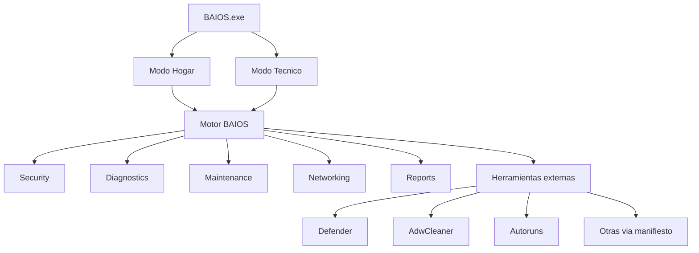

# Visión de BAIOS

BAIOS (*Blinter All In One Security*) es un **Security & Diagnostic Toolkit** para Windows: un centro de operaciones que orquesta diagnóstico, seguridad y mantenimiento del equipo, y genera un reporte por sesión.

No es un antivirus. No compite con Microsoft Defender, Malwarebytes u otros motores. BAIOS **orquesta**: lee el estado del sistema, lanza herramientas propias o de terceros, interpreta resultados y deja un informe que un usuario o un técnico pueden llevarse.

El software de terceros se declara, se lanza y (desde 4.1) se actualiza por manifiesto. Cada fabricante conserva su licencia. El uso es bajo responsabilidad del usuario: algunos motores marcan archivos de sistema como sospechosos (falsos positivos). No se deben eliminar archivos sin saber qué son.

## Evolución

| Versión | Enfoque | Tecnología |
| --- | --- | --- |
| BAIOS 1 | Automatización básica de herramientas | `.BAT` |
| BAIOS 2 | Presentación y menú | AutoPlay Media Studio |
| BAIOS 3 | Aplicación Windows (launcher de portables / ejecutables / online) | WinForms, .NET Framework 4.7.2 |
| BAIOS 4 | Plataforma de diagnóstico y seguridad (orquestador) | .NET 8 + WPF self-contained, ver [arquitectura](arquitectura.md) |

## Problema que resuelve

Un técnico o un usuario con un PC Windows necesita, en una sola pasada: ver si Defender y el firewall están activos, inventario de hardware, estado de disco y red, limpieza y reparación básicas, segunda opinión antimalware cuando haga falta, y un reporte para dejar constancia.

Flujo objetivo:

> Conecta BAIOS → ejecuta diagnóstico → revisa seguridad → revisa hardware → revisa red → ejecuta mantenimiento → genera reporte.

## Público

Un motor, dos modos desde 4.0:

| Modo | Quién | Qué ve |
| --- | --- | --- |
| **Hogar** | Usuario doméstico | Dashboard claro, alertas, acciones seguras, pocas herramientas externas. |
| **Técnico** | Técnico de sistemas | El mismo motor, más detalle y un flujo guiado USB/PC hasta el reporte. |

Las ediciones históricas Lite / Full / Rescue se replantean:

- **Lite** → modo Hogar.
- **Full** → repositorio de herramientas (manifiesto, no un ISO gigante).
- **Rescue** (LiveCD) → fuera de 4.0; candidato 4.2+. Una edición empresarial queda más allá de 4.2.

## Qué no es BAIOS

- No sustituye el antivirus residente.
- No reimplementa AdwCleaner, Autoruns ni otros motores de terceros.
- No es una recopilación masiva de `.exe` embebidos que hay que recompilar cada vez que una herramienta se actualiza.
- No es un LiveCD en 4.0.

## Arquitectura de producto

Módulos nativos del motor (4.0): Inicio, Seguridad, Diagnóstico, Mantenimiento, Red, Reportes. Las herramientas externas se lanzan; no se actualizan solas hasta 4.1. Detalle en [arquitectura](arquitectura.md), [diseño funcional](diseno-funcional.md) y [reportes](reportes.md).

## Principios

- Orquestar, no reemplazar.
- Motor nativo primero; portables después.
- Probar cada herramienta antes de incluirla.
- Mostrar fabricante, versión, EULA, arquitectura y si requiere administrador.
- Advertir falsos positivos y no borrar a ciegas.
- Actualizar herramientas por manifiesto (4.1), no recompilando BAIOS.
- Un reporte por sesión, con OK / aviso / fallo y recomendaciones.

## Alcance de 4.0

Entra: dashboard de estado, Defender, inventario y SMART cuando sea accesible, mantenimiento con confirmación (incluidos DISM/SFC; CHKDSK solo advertido), red básica, reporte texto/HTML, modos Hogar/Técnico, y lanzamiento de AdwCleaner, Microsoft Safety Scanner y Autoruns.

No entra: auto-updater de portables, instalador MSI pulido, LiveCD, edición empresarial, embebido masivo de antivirus. Ver [roadmap](roadmap.md).

## Código actual (BAIOS 3 / 6 Alpha)

El código de [`BAIOS/test2`](../BAIOS/test2.sln) **se congela para features**. Admite higiene (compilar, `.gitignore`, quitar código muerto). No es el producto 4.0.

| Pieza | Realidad |
| --- | --- |
| Stack | C# Windows Forms, .NET Framework 4.7.2 |
| Solución | prototipo `test2` |
| Formularios presentes | Bienvenida, Acuerdo, Menú, Ejecutables |
| Formularios ausentes | Online y Portables (`Form4` / `Form5`) nunca tuvieron fuente; las referencias muertas se eliminaron en higiene v3 |
| Versión en UI | `VERSION: 6 Alpha` |
| Ensamblado | `1.0.0.0` |
| Último changelog histórico | v3 (julio 2022) |
| Licencia del repo | GNU GPL v3 |

El backlog Lite (P0–P3) está **archivado** en [backlog.md](backlog.md), salvo higiene hecha: P3-01 (`.gitignore`) y P3-06 (handlers huérfanos). No se restauran Form4/Form5.

## Documentos de BAIOS 4

| Doc | Contenido |
| --- | --- |
| [01. Visión](vision.md) | Este archivo |
| [02. Arquitectura](arquitectura.md) | Stack, módulos, permisos |
| [03. Catálogo](catalogo.md) | Herramientas y vigencia |
| [Inventario](inventario.md) | Disco local: en uso / pendiente / desuso (no es el catálogo) |
| [04. Diseño funcional](diseno-funcional.md) | Pantallas y comportamiento |
| [05. Actualización](actualizacion.md) | Manifiesto y updates |
| [06. Reportes](reportes.md) | Generación y exportación |
| [07. Seguridad](seguridad.md) | Admin, hashes, descargas |
| [08. Roadmap](roadmap.md) | 4.0 / 4.1 / 4.2 |
| [Backlog](backlog.md) | Trabajo por fases |

## Entorno de desarrollo

BAIOS no es un sitio PHP ni necesita XAMPP. El clone puede vivir en `htdocs` solo por hábito de Git. Ítem archivado P3-05; higiene del repo nuevo en F5 / P3 archivado.
